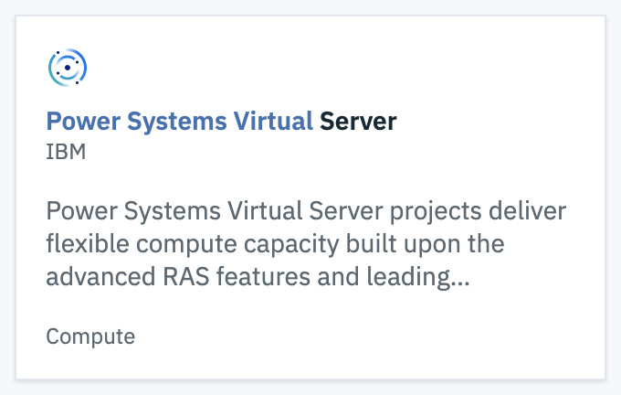
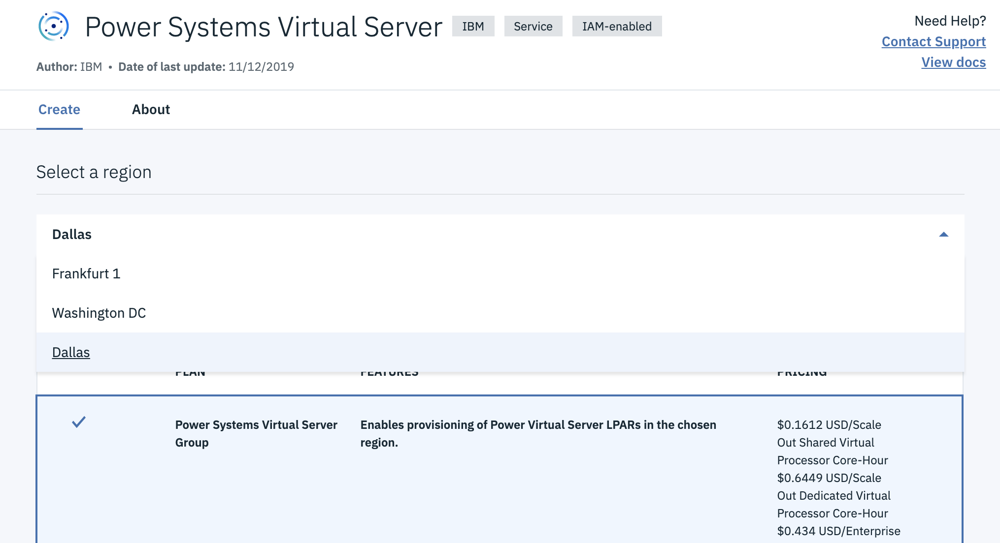
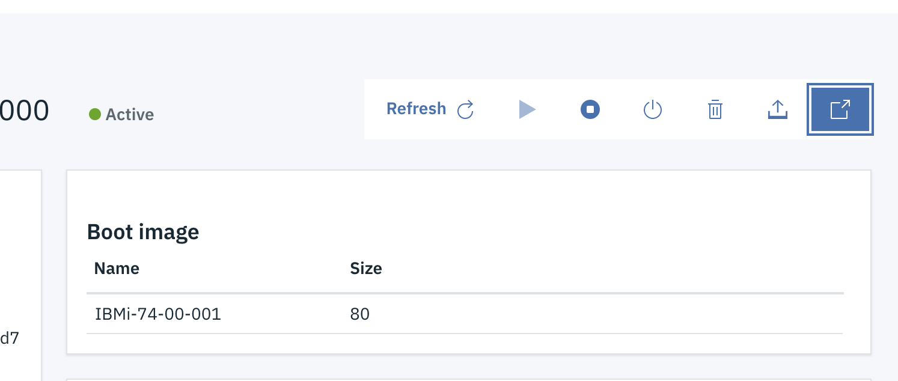
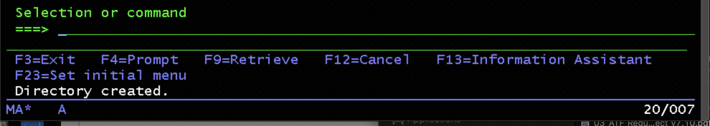
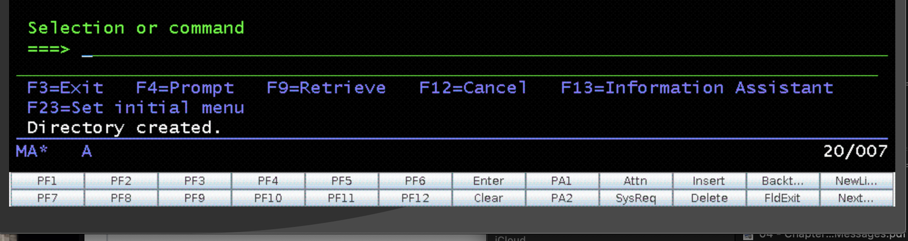
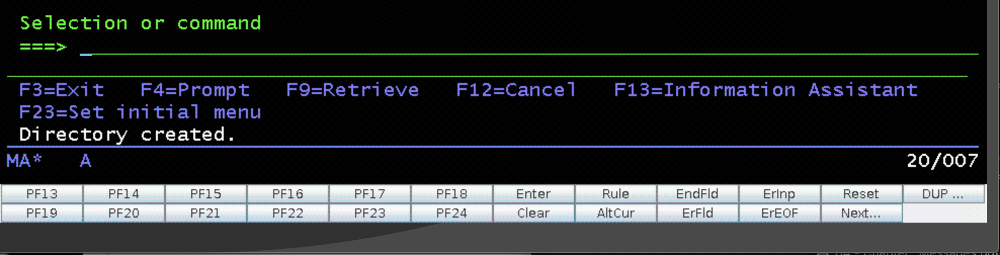

# ibmi-on-power-vps
setting up an IBMi instance on Power Virtual Server instance in IBM Cloud

NB: you will need to have a Pay-As-You-Go or Subscription account on IBM Cloud
to be able to set up an IBMi (or AIX) virtual server.

The first in the journey requires a "Power Systems Virtual Server" service instance,
which you wiill find through the `Catalog` menu.

Search for "Power Systems Virtual" and you should find one entry:
.

Click on that tile, and you will be presented with a service creation form, and have the option to 
select where you want your IBMi instance(s) to be created.

Current (Dec 2019) choices are:
+ Dallas
+ Washington DC
+ Frankfurt

Frankfurt appears to have larger capacity available, so pick that region/location,
unless you need your system to be in the USA.



Click `Create` and a new service instance will be established for you.

## ssh keys

## terminal emulation
when your VPS LPAR is active, you will be able to launch access to the virtual console through the web emulator.


note that the emulator supports Function Key emulation with a virtual keypad at the bottom of the window - 
actually, this keypad is initially hidden below the bottom of the window -- you will need to stretch the window to 
make the keypad visible. This is necessary for any function keys higher than 12, whether your keyboard has
physical function keys or not.
  
  
  

## first login

+ QSECOFR/QSECOFR -- change the password (max length is defaulted to 8 - you can update this later by running
  ```
  CHGSYSVAL QPWDMAXLEN VALUE('16')
  ```
  for whatever length of password you want to accommodate.
+ **accept all the software licence agreements (20 or more) -- each group must be viewed and accepted individually**
+ create a user profile for regular login instead of QSECOFR (if this user is set up with *SECOFR authority,
  remember to set 
  ```
  CHGSYSVAL QLMTSECOFR VALUE('0')
  ```
  to allow login through 5250 terminal sessions
+ make sure the SSH daemon is running
  ```
  STRTCPSVR SERVER(*SSHD)
  ```
+ you may also want to enable telnet for 5250 sessions
  ```
  STRTCPSVR SERVER(*TELNET)
  ```
+ if/when you want to install [open source packages](https://bitbucket.org/ibmi/opensource/src/master/), 
  you will need the IBMi LPAR to be able to resolve hostnames; by default, the domain nameserver defined
  in TCP Configuraiton is `9.9.9.9` - this will not work. 
  A workable alternative is to point to Google's public DNS server:
  ```
  CHGTCPDMN INTNETADR('8.8.8.8' *SAME *SAME)
  ```
+ update the DST login as the password will be set to expired, using the supplied documentation - 
  [config docs](https://cloud.ibm.com/docs/infrastructure/power-iaas?topic=power-iaas-configuring-ibmi)
  
 ## ACS setup
 
With your LPAR up and running, and limited connectivity via the public interface (only ssh (tcp/22) traffic is allowed through), you need to set up port-forwarding through ssh "tunnels".

ACS needs access to a variety of services, mostly located through the `as-svrmap` daemon which runs on port tcp/449. It is not practical to relate/remap this well-known service port, so the ssh tunnel needs to be bound to the same port. Ports below 1024 are known as "privileged" ports, and require root/admin-level rights to create a listener; 
 + for linux/Mac client, you will need to run the ssh connection with root authority with `su` or `sudo` (not mentioned in the current documentation) -- [ssh setup for ACS](https://cloud.ibm.com/docs/infrastructure/power-iaas?topic=power-iaas-configuring-ibmi#ssh-tunneling)
 + for Windows clients, you can set this up with [Putty](https://www.putty.org) -- full instructions here: [putty setup for ACS](https://www.ibm.com/support/pages/ssh-tunnel-configuration-use-ibm-i-access-client-solutions)
 
The net result is your client will have a group of ports forwarded through the ssh tunnel to the associated ports on the IBMi LPAR.

| local port | remote port | service|description|
|---:|---:|:----|:---:|
|23|23|telnet| terminal access (assumes telnetd not already running on your client machine)|
|2001|2001|http-admin|IWS admin|
|2005|2005|Navigator for web| Web admin|
|449|449|as-svrmap| service location broker|
|8470|8470|as-central| licence manager|
|8471|8471|as-database| database connector|
|8472|8472|as-dtaq| data queue gateway|
|8473|8473|as-file| IFS files gateway|
|8474|8474|as-netprt| network printer|
|8475|8475|as-rmtcmd| remote command service|
|8476|8476|as-signon| signon verification|

To use these tunneled port in ACS, make sure to define the remote server IP address as "127.0.0.1", rather than its actual public address - that link is established by the ssh/putty session.
