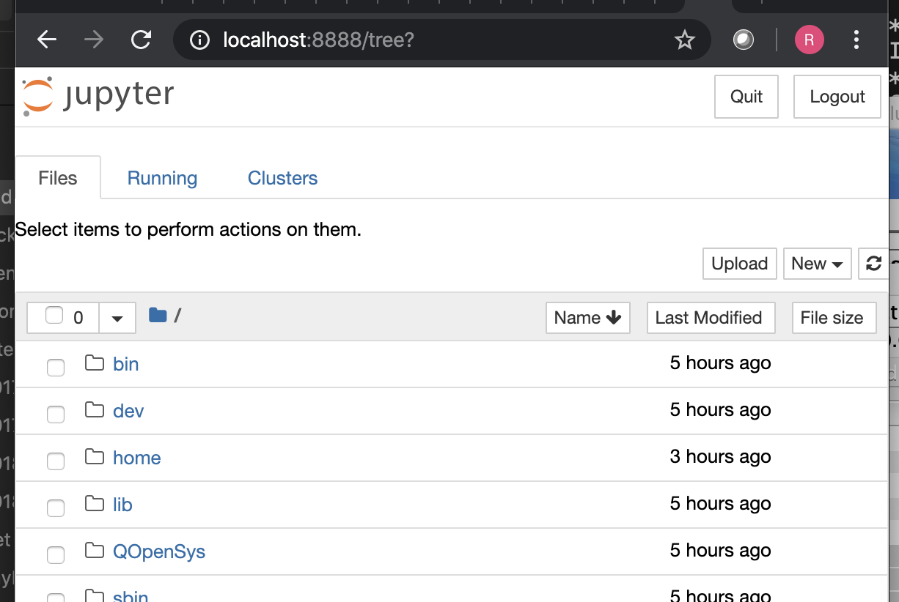

# Using Jupyter Notebooks with IBM i

The IBM i open source team have created installable packages for a growing number of runtimes;
of particular interest for data science and machine learning (ML) is Python - sample packages and install
instructions make it straightforward to establish a Jupyter Notebook service.

[installing python ML](https://github.com/IBM/ibmi-oss-examples/tree/master/machinelearning)

Install the python3 runtime support:
```
python3	
python3-ibm_db
python3-numpy
python3-pandas
python3-pip
python3-pyodbc
python3-scikit-learn
python3-scipy
python3-setuptools
python3-wheel
```
and `python3-pyzmq` package with yum (or through ACS), before using pip to install the Jupyter package group.
```
pip3 install jupyter
```
Once installed, launch Jupyter Notebook and note the URL to access the server; by default, the service will bind to tcp/8888.
```
jupyter notebook
```
 <br>[I 23:33:09.176 NotebookApp] Serving notebooks from local directory: /
 <br>[I 23:33:09.176 NotebookApp] The Jupyter Notebook is running at:
 <br>[I 23:33:09.176 NotebookApp] http://localhost:8888/?token=1960e9c008a3829fd0ed57xxxxxxxxxacecf90d35cf2dc8
```

To access from a client workstation/laptop, add a port-forwarding definition to allow access to the IBM i server - 
e.g. `-L 8888:localhost:8888`


